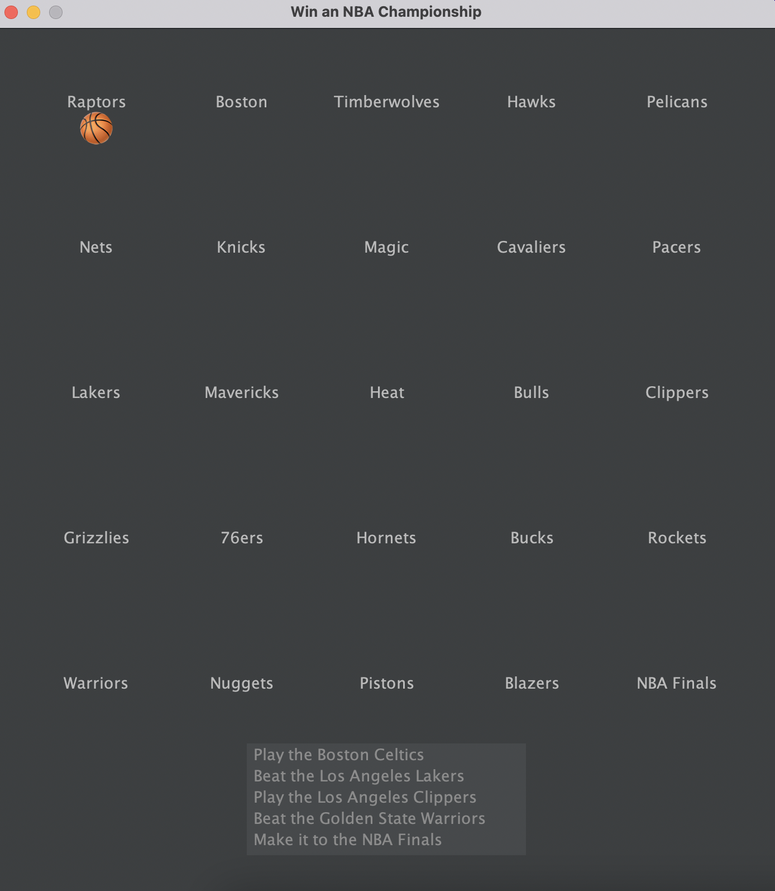
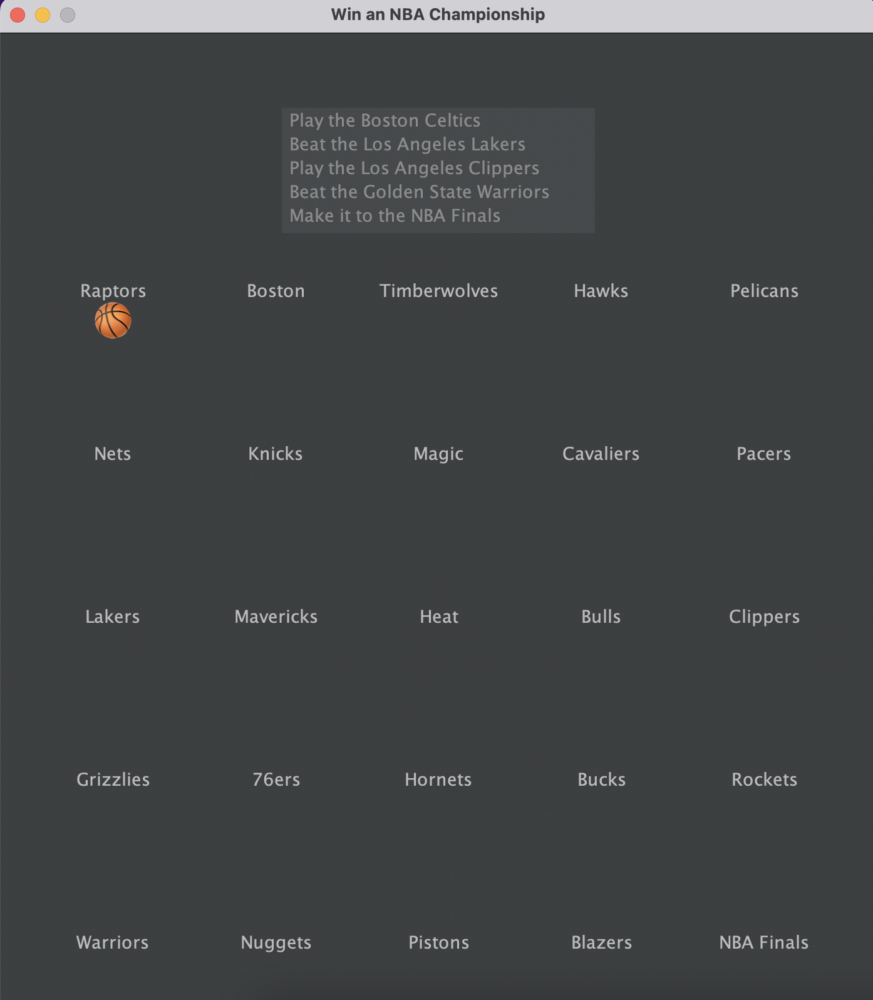
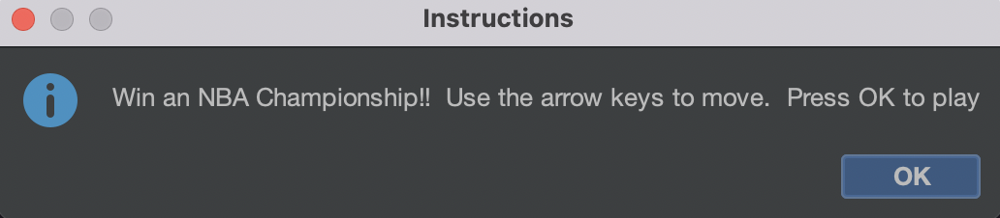
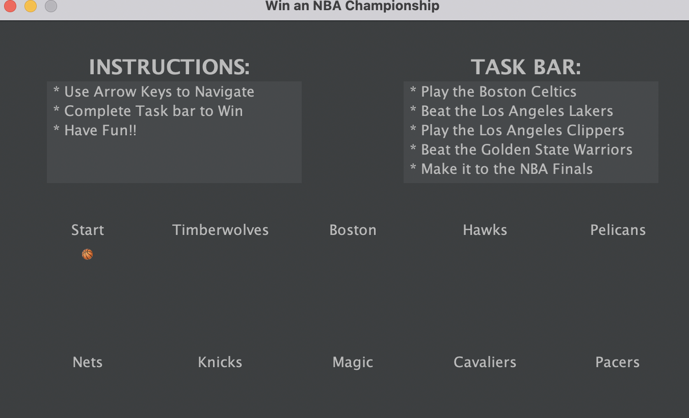
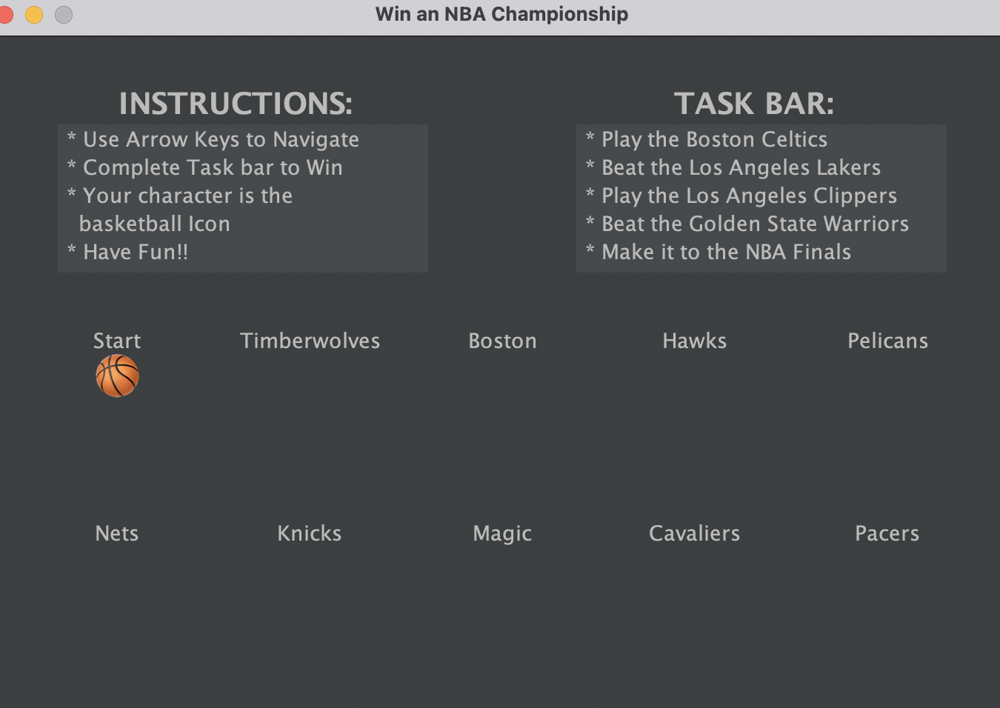
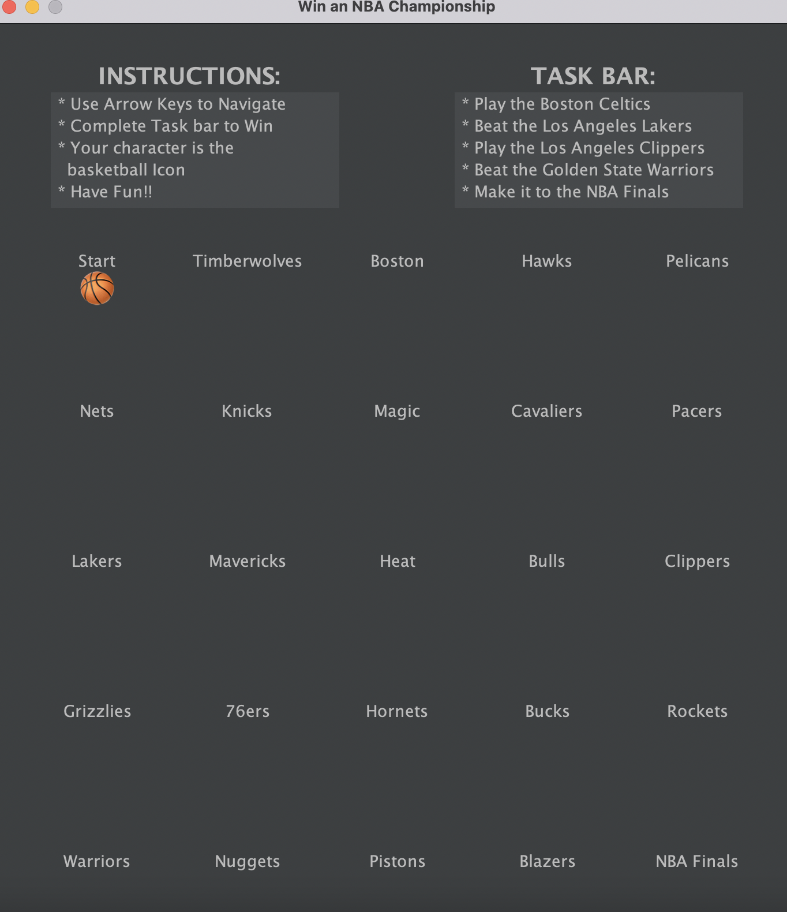

# Test Plan and Evidence / Results of Testing

## Game Description

The project involves the programming of a game.

In this game you are to try and win an NBA championship.
Although it may seem easy when you start the game, 
you have to complete a series of tasks before you can take away the trophy.

### Game Features and Rules

The game has the following features and/or rules:

- The user is the basketball that shows up on the screen.
- Each team name shown on the screen is a square that the player can move to using the arrow keys.
- There is a task bar on the game for the user to see.
- The user have to complete all the tasks before they can win the championship.

---

## Test Plan

The following game features / functionality and player actions will need to be tested:

- The functionality of the task bar, being big enough for the user to see 
and allow them to understand what's going on.
- Whether the player Icon is visible for the user and if they know it's them.
- Another game feature that I will need to test in action will be the layout of the map.
- The last feature that I will have to ensure is functional and readable to the user is 
the instructions. This is important as they need to know what they are doing in this game.

All of these actions will be tested by my parents, I will show them the game and try get them to 
play it. Any feedback they give me I will use to make changes to my game so it makes it easier and
more understandable for them to play.

The following tests will be run against the completed game. The tests should result in the expected outcomes shown.

### Task Bar

Test if the is helpful and visible for the users

#### Test Data / Actions to Use

I will get my parents to the play the game. If they don't understand what there is to do because they
can't see or tell what the task bar means then I will have to make changes.

#### Expected Outcome

I don't think I will have to make any changes as I will make the task bar big enough for them to
see in the first place.

### Player Icon

If the player Icon is visible to the user and if they understand that it is their icon.

#### Test Data / Actions to Use

Get my parents to play the game as stated above. If they are lost as to what they are doing, and don't
know where to start, then I will have to tell them and make changes to the UI so further users understand.

#### Expected Outcome

When creating the UI, I will ensure to have the basketball icon big enough for the user to know that
it is them and that is there icon to move around to achieve. If that does not work, then I will add text
to the game so they know. I don't want to have to do that at the start because the game would look cleaner
without it. But I will if I have to.

### UI setup/map layout

See if the setup is clean and if the UI holds everything that is required of it.

#### Test Data / Actions to Use

I will start the game multiple times to understand the layout and what works best.
Things like aesthetics and usability will come into factor in testing this.

#### Expected Outcome

I will be able to know what does not look right or if something does not fit on the UI if I run
it multiple times.

### Instructions

Whether they are understandable and noticeable for the user.

#### Test Data / Actions to Use

By getting people to play my game and getting feedback on whether it was easy to read, find and 
makes them understand what to do. 

#### Expected Outcome

That the users will give me feedback on the instruction tab, so I can make it better or keep it the same
depending on what they would like me to do.

---

## Evidence / Results of Testing

### Task Bar

After allowing my parents to play my game. They told me after some
confusion that they did not even realise the task bar was even there.
They then gave me options to choose from to change it:
- Change the colour of the task bar to pop out.
- Bring it to the top of the screen so its the first thing visible.
- Make it a separate tab that pops up before the game starts.

We ended up deciding on bringing it to the top as it suits the
rest of the UI better than the color, and the other tab would've just
been annoying for the user to continually look at.

### Instructions

My parents also noted that the tab that came up with the instructions was
missed as they just skipped over it trying to get to the game. To change
this, I added the instructions to the top of the page so they can see them
whilst playing also. This means they can always see them so they 
understand what to do.

### Player Icon

When my parents played the game, they stated that they did not realise
that the ball was their icon. They tried to choose a team at the start not
realising that they were meant to move the ball around. To change this, 
I made the ball a little bit bigger, but still small enough for the names
of the teams and places to be visible. I also put that the basketball is
their icon in the instruction tab so they dont get any confusion there.

### UI setup/map layout

As you can see from the two pictures, there is a lot more detail on the
second one that is designed to help the user understand the functionality
of the game and make it easier for them to play. This does not take away
difficult factor from the game as they still have to complete the tasks 
before they can win.
Thanks to my parents feedback I was able to successfully test and change 
my game to make it overall functionally pleasing for users.

